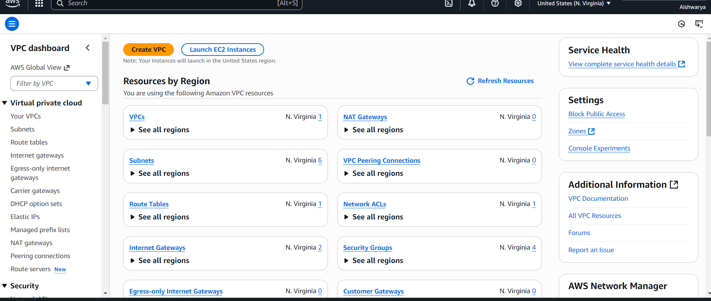
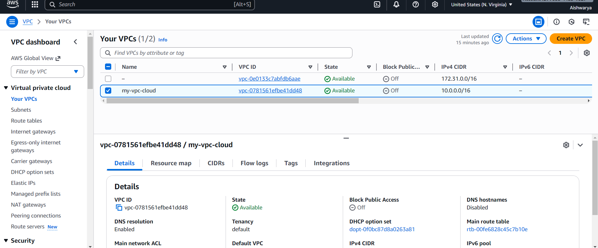
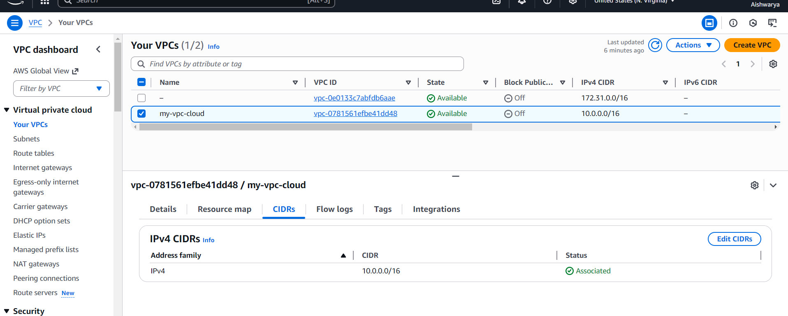
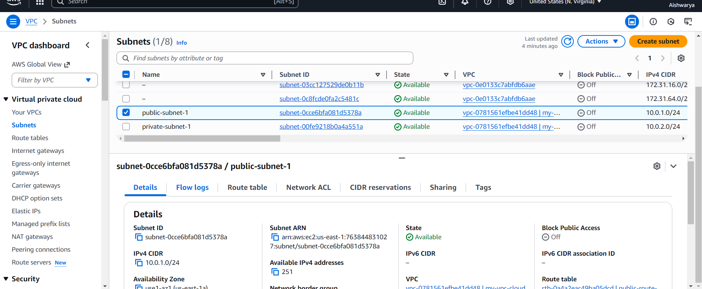
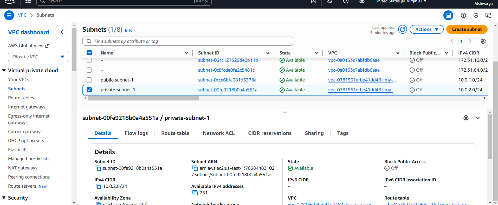
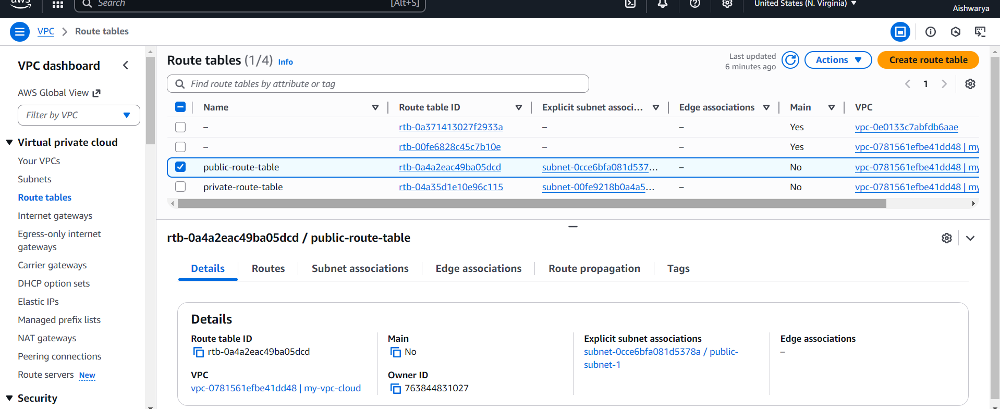
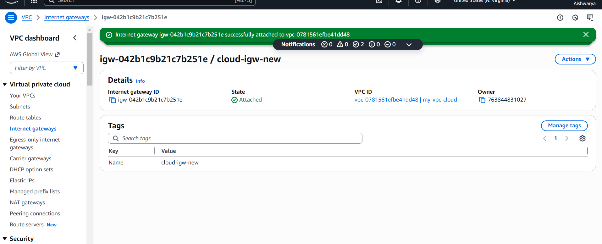

# AWS-VPC-Practical
Create and Configure a Virtual Private Cloud (VPC) with Subnets

## 🎯 Objective
The goal of this task was to understand how cloud networking works by creating a Virtual Private Cloud (VPC) with both public and private subnets, while enabling controlled internet access.  
This exercise helps understand how resources can be isolated and protected in the cloud.

## 🛠️ Tools Used
- AWS Free Tier  
- Services: VPC, Subnets, Route Tables, Internet Gateway, Security Groups

## 📦 What I Delivered
- Screenshots of:  
  - VPC Dashboard  
  - VPC Name and CIDR  
  - Subnets  
  - Route Table  
  - Internet Gateway  
- Short description including CIDR ranges, subnets, region, and internet access setup

## 🧭 Steps I Followed

1. **Login to AWS Console**  
   - Opened the VPC Dashboard

2. **Created the VPC**  
   - IPv4 CIDR block: `10.0.0.0/16`  
   - This creates a private network that can contain multiple subnets

3. **Created Subnets**  
   - **Public Subnet:**  
     - CIDR: `10.0.1.0/24`  
     - Auto-assign public IP enabled  
     - Placed in AZ: `us-east-1a`  
   - **Private Subnet:**  
     - CIDR: `10.0.2.0/24`  
     - Auto-assign public IP disabled  
     - Placed in AZ: `us-east-1b`

4. **Created and Attached Internet Gateway (IGW)**  
   - Created IGW and attached it to the VPC  
   - This allows the public subnet to access the internet

5. **Configured Route Tables**  
   - **Public Route Table:**  
     - Added route: `0.0.0.0/0 → Internet Gateway`  
     - Associated only with the public subnet  
   - **Private Route Table:**  
     - No internet route  
     - Associated only with the private subnet

6. **Verified Setup**  
   - Confirmed that:  
     - Public subnet has internet access  
     - Private subnet remains isolated

## 📸 Screenshots

### VPC Dashboard

### VPC Name and CIDR

### Subnets

### Route Table

### Internet Gateway

## 📝 Summary
- **VPC CIDR Range:** 10.0.0.0/16  
- **Public Subnet CIDR:** 10.0.1.0/24  
- **Private Subnet CIDR:** 10.0.2.0/24  
- **Region:** N. Virginia (us-east-1)  
- **Number of Subnets:** 2 (1 public, 1 private)  
- **Internet Access:** Enabled for public subnet, disabled for private subnet

## 💡 What I Learned
- How to **create and configure a VPC** in AWS  
- How to **create public and private subnets** and assign CIDR blocks  
- How **internet access is controlled** using Internet Gateways and Route Tables  
- How to **associate route tables with specific subnets** to isolate private resources  
- Understanding **Availability Zones (AZs)** and how subnets can span them  
- The difference between **public and private subnets** and why isolation matters  
- How to **visualize and document cloud network architecture** with screenshots
